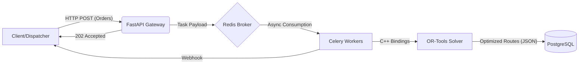

"""
# Hi there, I'm José Luzardo 👋

### Backend Engineer | High-Performance Systems | Optimization

I am a **Backend Engineer** specialized in solving NP-hard logistical problems and building high-throughput financial systems. My focus is on **latency reduction**, **mathematical optimization**, and **distributed architecture**.

Currently architecting logistics solutions at **Tía S.A.** and building compliance engines for **Fintech**.

---

## 🛠️ The Arsenal (Tech Stack)

| Core & Performance | Cloud & DevOps | Data & Messaging |
| :--- | :--- | :--- |
|  |  |  |
|  |  |  |
|  |  |  |
|  |  |  |
|  |  |  |

---

## 🔒 Selected Work & Architecture Case Studies

> *⚠️ **Note:** Most of my work involves proprietary algorithms and corporate infrastructure protected by **NDAs**. While the source code is private, the architectural patterns and outcomes are documented below to demonstrate engineering capacity.*

### 🚛 Project: Enterprise Logistics Optimization (SDVRP)
**Context:** Optimizing daily route dispatch for a retail giant with a **heterogeneous fleet** and complex site-access constraints across 200+ vehicles daily. The logistics unit is the "Caddie" (Roll Container).

**The Engineering Challenge:**
The routing problem was not a simple VRP, but a **Split Delivery VRP (SDVRP)** with Time Windows. Legacy manual routing failed to optimize fleet mixing due to complex constraints:
1.  **Heterogeneous Fleet Capacities:** The fleet consists of Small (1-15 caddies), Medium (12-20 caddies), and Large (21-25 caddies) trucks.
2.  **Site Access Restrictions:** Certain store locations physically cannot receive Large trucks, forcing the usage of smaller, less efficient vehicles.
3.  **Split Delivery Logic:** If a store demands 34 caddies but only accepts Medium trucks, the system must intelligently split the order (e.g., 2 Medium trucks) rather than failing.
4.  **Cost Function Complexity:** Each truck type has a specific fixed fee ($55 Small, $70 Medium, $90 Large). The solver needed to evaluate if sending *2x Medium ($140)* was cheaper or more viable than *1x Large + 1x Small ($145)* based on total distance and fleet availability.

**The Solution:**
* **Mathematical Modeling:** Engineered a custom **Constraint Programming model** using **Google OR-Tools** (C++ bindings). I implemented a multi-dimensional cost function that minimizes Total Cost of Ownership (TCO) by balancing distance traveled against fixed fleet costs and time window penalties.
* **Event-Driven Architecture:** Decoupled the CPU-intensive solver from the API using a "Fire-and-Forget" pattern (FastAPI -> Redis -> Celery) to eliminate HTTP 504 Timeouts caused by long calculation windows (30s+).

**Business Impact:**
* 📉 **15% Reduction** in operational transport costs (~$30k monthly savings) via optimized fleet mixing and smarter split deliveries.
* 🚀 **70% Reduction** in solver cold-start times through containerization (Docker).
* ✅ **Zero Downtime** deployments using Docker & CI/CD pipelines.

---

### 💸 Project: High-Frequency AML Screening Engine (Fintech)
**Context:** Real-time Anti-Money Laundering (AML) verification against international sanctions lists (OFAC, Interpol, UNO).

**The Engineering Challenge:**
The initial Python-based fuzzy matching implementation suffered from high latency (>400ms) during real-time transaction flows. Additionally, relying on managed cloud services (AWS) was becoming cost-prohibitive at scale. Data ingestion was also fragile due to fragmented government sources.

**The Solution:**
* **Polyglot Migration:** Rewrote the core matching engine in **Go (Golang)**, utilizing concurrent goroutines for parallel list scanning and in-memory struct optimization to reduce Garbage Collection overhead.
* **Bare Metal Infrastructure:** Migrated from Managed Cloud to self-hosted **Hetzner Dedicated Servers**, manually configuring Linux networking and Docker orchestration. This allowed for raw CPU access without the "noisy neighbor" problem of shared VPS.
* **Security Middleware:** Implemented a custom RBAC (Role-Based Access Control) middleware to enforce strict data isolation between Auditors and Operators.
* **Resilient Data Pipeline:** Built a custom scraping engine capable of automated captcha solving to reliably ingest data from unstable government portals.

**Business Impact:**
* ⚡ **10x Latency Improvement** (Sub-50ms p99 response time).
* 💰 **80% Cost Reduction** in infrastructure by moving to Bare Metal.
* 🐳 **Binary Optimization:** Production artifact reduced from >500MB (Python) to <20MB (Go Scratch image).

---

### 🧾 Project: SaaS Invoicing Platform (FacPlus)
**Context:** Building a multi-tenant SaaS for electronic invoicing from zero to production (MVP).

**The Engineering Challenge:**
The legacy infrastructure (Ubuntu 24.04) shipped with OpenSSL 3.1, which deprecated specific algorithms required to decrypt legacy .p12 digital signatures used by the local tax authority (SRI). The PHP/Laravel core could not handle the decryption natively without downgrading the entire OS security posture.

**The Solution:**
* **Microservices Bridge:** Architected an isolated **Python microservice** specifically to handle the cryptographic operations (using `cryptography` libraries), creating a bridge between the modern infrastructure and legacy file formats.
* **SaaS Business Logic:** Engineered complex subscription lifecycle management, handling plan upgrades (prorated billing), downgrades, and automated expiration logic for thousands of tenant accounts.
* **Full-Stack Delivery:** Developed the web platform (Laravel/Blade) and the companion Mobile App using **Flutter**, designing RESTful APIs for real-time data synchronization.
* **Access Control:** Designed granular Role-Based Access Control (RBAC) for hierarchical user management (Super Admin, Admin, Operator).

### 📬 Connect
* **Email:** [jose.luzardo.tech@gmail.com](mailto:jose.luzardo.tech@gmail.com)
* **LinkedIn:** [linkedin.com/in/joseluzardo](https://linkedin.com/in/joseluzardo)
* **Location:** Ecuador (UTC-5) - Available for Remote Roles worldwide.
